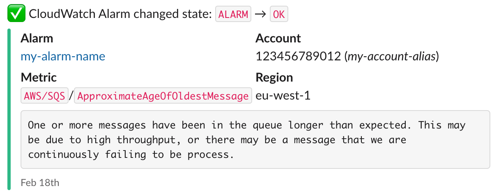
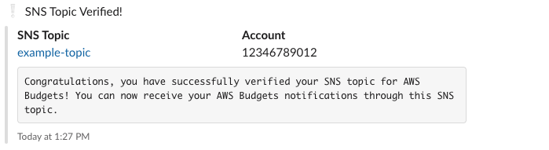

# terraform-aws-sns-to-slack
A Terraform module that forwards messages from AWS Simple Notification Service (SNS) to Slack.

The module applies different formatting depending on the type of the message.

Example formatting for an SNS message sent from a CloudWatch Alarm looks like this:

For other types of messages, the formatting looks like this:

